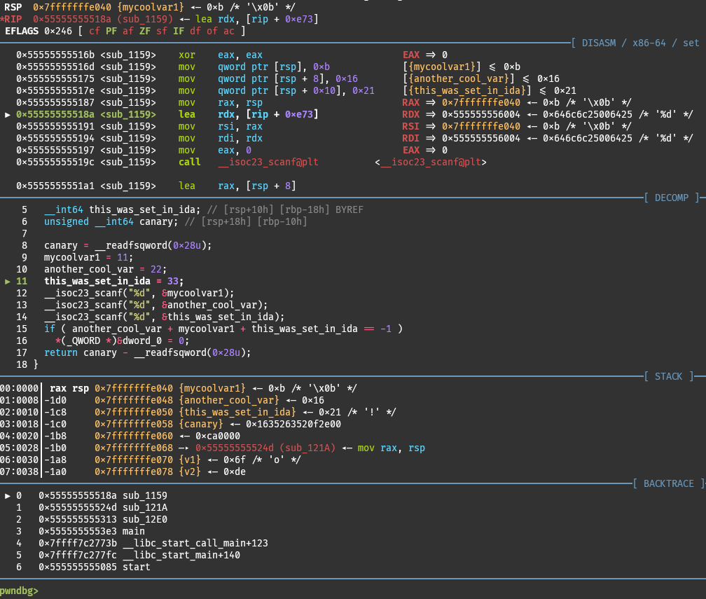

# Decompiler Integration
## Rundown

Pwndbg supports decompiler integration with IDA, Binary Ninja, Ghidra and angr-managment. It works both for GDB and LLDB.

We implement integration via [decomp2dbg](https://github.com/mahaloz/decomp2dbg) (<3) decompiler plugins. All decompiler-side logic is done via decomp2dbg, and all debugger-side logic is handled by Pwndbg.

Since you need to be able to use plugins in your decompiler, this means you need a license for IDA and Binary Ninja, which do not support plugins in their free versions.



## Setup

To install the appropriate decompiler plugin simply run
```{.bash .copy}
di install <name of your decompiler>
```
inside of Pwndbg, and you are ready to go. For more information, see `di install --help`. **Do not install decomp2dbg manually**, because we take care to get the proper version and set up symlinks. If you already have it installed, `di install` will override that cleanly. You are still able to use decomp2dbg outside of Pwndbg, even if you install it Pwndbg's `di install`.

After installation, you can open your decompiler, press `Ctrl+Shift+D` and click `OK` to start the decompiler plugin (XML RPC) server.

Then, inside of Pwndbg you can run
```{.bash .copy}
di connect
```
to connect to the decompiler. If the process is alive at that point, this will also run `di sync` automatically. If the process was not alive at that point, you can run
```{.bash .copy}
di sync
```
manually after you start the debugged process.

Since syncing symbols with the decompiler can be expensive, we do not do it automatically by default. So, everytime you want to sync functions / global variables with the decompiler, simply re-run `di sync`. If you want this to be automatic, check out `help set decompiler-autosync-syms`. Function-local variables are synced automatically by default.

## Features

You can always see all decompiler integration-related commands by running
```{.bash .copy}
decompiler-integration --help
```
and all configuration variables by running
```{.bash .copy}
config decompiler
```

Here is a non-exhaustive list of things we support:

+ Clean plugin installation
+ Consistent experience between decompilers
+ A decompiler context window showing the decompilation of the current function
+ Syntax highlighting on the decompilation
+ Works with shared libraries
+ We apply the decompiler's symbols (functions and global variables) to the debugger, so you can use `print decompile_func_name`
+ We add function-local variables and arguments as convenience variables so you can use `print $decompiled_var_name`
+ The function-local variables support primitive types, so you can often do `print *$decompiled_var_name` and get the correct result (only in GDB, in LLDB they are always `void*`).
+ Show function-local variables for all functions in the current backtrace with `di list --all`
+ Show symbols and function-local variables in assembly instruction annotations
+ Show symbols and function-local variables when telescoping
+ Optional automatic syncing with the decompiler

Planned future support:

+ Sync decompiler-defined types and properly size global variables using them
+ Retrieve function signature information and show the arguments on `call`-type instructions
+ Retrieve comments along with the decompilation (currently works only for IDA, need to bring other decompilers up to speed)
+ Support multiple Binary Ninja decompilation styles
+ Sync breakpoints
